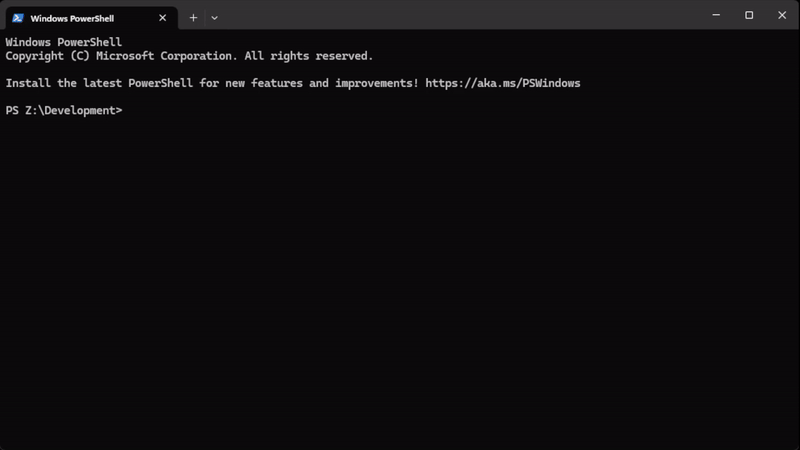

<!--suppress HtmlDeprecatedAttribute -->

# What-rs

_The easiest way to identify anything_ 🔎

A reimplementation of the popular [pyWhat](https://github.com/bee-san/pyWhat/)

## 🤔 `What` is this?

Imagine this: You come across some mysterious text 🧙‍♂️ `0x52908400098527886E0F7030069857D2E4169EE7` or `dQw4w9WgXcQ` and you wonder what it is. What do you do?

Well, with `what-rs` all you have to do is ask `what-rs "0x52908400098527886E0F7030069857D2E4169EE7"` and `what-rs` will tell you!

`what-rs`'s job is to **identify _what_ something is.** Whether it be a file or text! Or even the hex of a file! What about text _within_ files? We have that too! `what-rs` is recursive, it will identify **everything** in text and more!

---

⚠️ The project is under active development and not yet feature complete with [pyWhat](https://github.com/bee-san/pyWhat/) ⚠️

---

## ⚙ Usage

### 🌌 Other Features

Anytime you have a file, and you want to find structured data in it that's useful, `what-rs` is for you.

Or if you come across some piece of text, and you don't know what it is, `what-rs` will tell you.

### 📁 File & Directory Handling

**File Opening** You can pass in a file path by `what-rs 'this/is/a/file/path'`. `what-rs` is smart enough to figure out it's a file!

What about a whole **directory**? `what-rs` can handle that too! It will **recursively** search for files and output everything you need!

### 🔍 Filtering your output

Sometimes, you only care about seeing things which are related to AWS. Or bug bounties, or cryptocurrencies!

You can filter output by using `what-rs --rarity 0.2:0.8 "thing/to/identify""`. Use `what-rs --help` to get more information.

> [!IMPORTANT]
> Filtering by tags (by using --include etc.) and sorting options are not yet fully implemented but will come in the next releases.

## 🙏 Thanks

Big thanks to bee-san and everyone who worked on [pyWhat](https://github.com/bee-san/pyWhat/) for their amazing work on!
Without them this project wouldn't exist. 